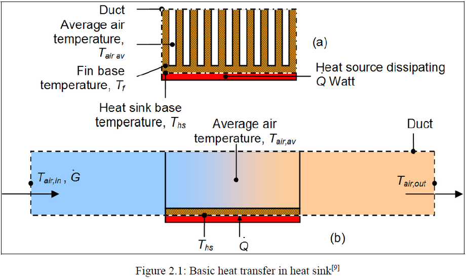

# Parametric Optimization of Heat Sinks using CFD and Optimization Techniques

A comprehensive engineering study focused on modeling, simulating, and optimizing thermal performance and pressure drop characteristics for advanced heat sink designs using Computational Fluid Dynamics (CFD), Artificial Neural Networks (ANN), Extreme Learning Machines (ELM), and Genetic Algorithms (GA).

---

## Project Overview
* **Objective:** Investigate the parametric optimization of heat sink geometries (cylindrical, square pin-fins, and rectangular plate-fins) to maximize heat dissipation while minimizing pressure drop penalties under forced convection.
* **Core Methodologies:** Coupled CFD simulations with surrogate modeling (ANN and ELM) and multi-objective evolutionary optimization (Genetic Algorithms).
* **Team & Guidance:** 
  * **Co-Authors:** Mohammed Wafeeq, Ashutosh Mohapatra, Taran Poojari
  * **Faculty Advisor:** Dr. Arvind Deshpande (VJTI Mumbai)

---

## Project Preview & Flow Visualization

*(Visualization of convective heat transfer, boundary layer development, and thermal gradients across fin arrays)*

---

## Key Technical Workflows & Methodology

1. **Geometric Modeling & Meshing:** 
   * Designed parametric fin configurations in SolidWorks. 
   * Generated high-quality unstructured tetrahedral meshes with structured prismatic inflation layers near solid boundaries to accurately resolve steep thermal and velocity gradients ($y^+ \approx 1$).
   * Performed rigorous mesh independence studies (stabilizing beyond ~1 million elements with $<0.65\%$ variation).

2. **CFD Analysis (ANSYS Fluent):** 
   * Solved steady-state Navier-Stokes and energy equations using the Realizable $k-\varepsilon$ and SST $k-\omega$ turbulence models.
   * Evaluated Nusselt numbers ($Nu$), friction factors ($f$), convective heat transfer coefficients ($h$), and pressure drops ($\Delta P$) across staggered and inline arrays.

3. **Surrogate Modeling (ANN & ELM):** 
   * Developed and trained **Artificial Neural Networks (ANN)** and **Extreme Learning Machines (ELM)** using data generated from analytical correlations and CFD datasets.
   * Optimized learning rates and network architectures (achieving high coefficients of determination, $R^2 > 0.99$), bypassing the need for computationally expensive repeated CFD runs during optimization loops.

4. **Global Optimization (Genetic Algorithms):** 
   * Implemented MATLAB’s Genetic Algorithm Toolbox and Pareto-front multi-objective optimization to balance competing objectives: maximizing heat transfer coefficient while minimizing pressure drop and overall heat sink mass.

---

## Key Results & Findings

* **Configuration Comparison:** 
  * Staggered pin-fin arrays demonstrated superior fluid mixing and boundary layer disruption, resulting in enhanced convective heat transfer compared to inline arrays, though accompanied by higher pressure drops.
  * Square pin-fins induced stronger vortex shedding and wake formation due to their sharp edges, yielding higher Nusselt numbers than circular pins at the expense of increased flow drag.
* **Geometric Parameter Effects:** 
  * Increasing fin height and pin diameter-to-spacing ratios ($D/S$) significantly improved thermal dissipation (higher $Nu$), but exhibited diminishing returns due to exponential rises in pressure drop and hydraulic resistance.
* **Optimization Outcomes (Genetic Algorithms):** 
  * The multi-objective optimization Pareto-front successfully identified optimal channel widths, fin thicknesses, and lengths. 
  * The optimized rectangular heat sink achieved a **mass reduction of over 68%** (dropping from ~372 g to ~118.6 g) while maintaining exceptional thermal-hydraulic efficiency compared to baseline designs.

---

## Documentation & Repository Structure
* **[Download & View Final Year Project Report (PDF)](./FYP%20Report%20_final.pdf)**: Complete 119-page thesis documentation including comprehensive literature reviews, governing equations, full validation plots, ANN training curves, and Pareto-front optimization results.
* `Heat_Sink_Process.png`: Visual asset showcasing convective heat transfer principles and flow behavior.
